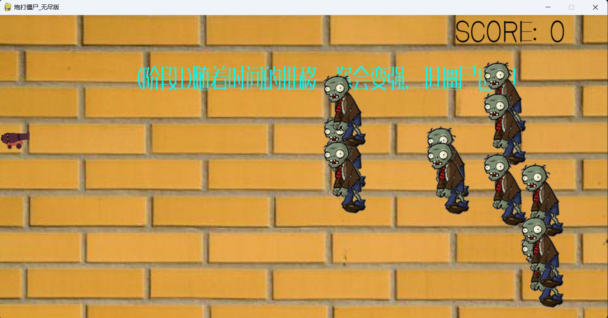

# 炮打僵尸（无尽版）

## 写在前面的话

准确的说这个是我小学六年级的参赛作品，初中的时候又重写了一下，最近闲的没事就应一些同学的需求就把这个项目开源了。

## 简介

**炮打僵尸**是一款用 Python 和 Pygame 制作的简单射击游戏。玩家将操作一门大炮，射击不断涌来的僵尸，阻止它们到达屏幕的左边缘。随着游戏进行，僵尸的速度会逐渐加快，游戏将变得越来越具有挑战性。

## 玩法

- 玩家通过鼠标控制大炮的垂直位置。
- 每次点击鼠标左键，大炮会发射一枚子弹。
- 每击中一只僵尸，玩家得分 +1。
- 如果任何僵尸到达屏幕的左边缘，游戏结束。

## 游戏特点

- **无尽模式**：僵尸会不断生成，随着时间推移速度会加快，考验玩家的反应力和操作水平。
- **背景音乐**：游戏中配有背景音乐，提升游戏体验。
- **分数系统**：实时显示玩家得分，并根据分数不同显示不同的游戏提示。
  
## 安装和运行

### 依赖安装

在运行游戏之前，请确保你的系统中已安装 Python 和 Pygame 库。如果尚未安装 Pygame，可以使用以下命令安装：

```bash
pip install pygame
```

### 运行游戏

1. 克隆或下载此项目代码到你的本地目录。
2. 确保所有资源文件（如背景音乐、图片等）位于项目目录的正确位置。
3. 使用以下命令运行游戏：

```bash
python zombie.py
```

## 项目结构

```
.
├── img/
│   ├── fonts/                     # 字体文件夹
│   │   ├── font1.ttf
│   │   ├── font2.ttf
│   │   └── font5.ttf
│   ├── Laura Shigihara - Zombies On Your Lawn.mp3  # 背景音乐
│   ├── move/                      # 僵尸移动图片文件夹
│   │   ├── 01.png
│   │   ├── 02.png
│   │   └── ... (其他僵尸图片)
│   ├── 2222 - C_COPY - C_COPY.png  # 大炮图片
│   ├── bullet.png                 # 子弹图片
│   ├── 不过.jpg                   # 背景图片
│   └── ZombiesWon.png             # 游戏结束背景图片
├── zombie.py                      # 主游戏脚本
└── README.md                      # 项目文档（即本文件）
```

## 游戏截图

> 
